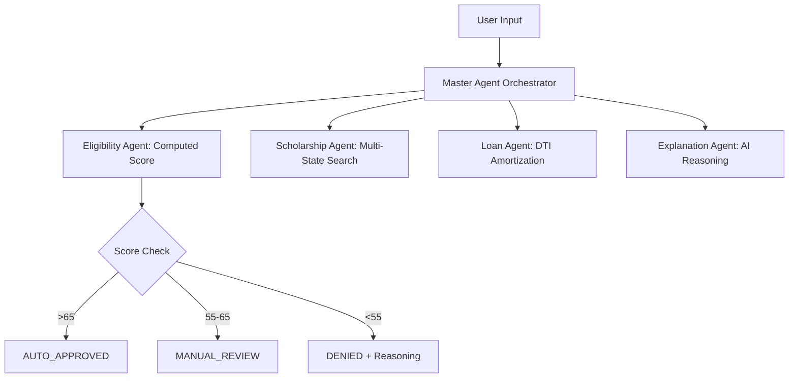

# 🚀 AlgoAlchemy — AI-Powered Student Funding Platform

[](https://github.com/Aditya-ha11/VidhyaSaarthi-ai)
[](https://github.com/Aditya-ha11/VidhyaSaarthi-ai)
[](https://ai.google.dev/)

**AlgoAlchemy** (formerly VidyaSaarthi) is a full-stack, asynchronous multi-agent AI platform built to decentralize student loan eligibility, multi-state scholarship matching, and disbursal decision-making. We transform the opaque "Rejected" stamp into an actionable, transparent roadmap for student success.

---

## 📌 Team Details - Team 07 (AlgoAlchemy)
*   **Biswajit Das**
*   **Shakti Prasad Mahanta**
*   **Mausumi Baral**
*   **Aditya Kumar Sahu**
*   **Mohit Pradhan**

---

## 🧩 The Problem
Millions of students face massive bottlenecks in educational funding:
1.  **Information Fragmentation:** Scholarships are scattered across hundreds of niche portals.
2.  **Financial Illiteracy:** Students often borrow beyond their family's capacity (DTI ratio).
3.  **Opaque Approvals:** Generic rejections leave students without a path forward.

## 💡 Our Solution
AlgoAlchemy acts as an **AI-powered financial counsellor** and rigorous underwriting engine. We utilize an asynchronous AI pipeline to:
- Instantly evaluate profiles using **Soft-Approval Thresholds**.
- Calculate exact **Amortized EMI Limits** to protect against predatory debt.
- Match students with high-probability grants across 9+ Indian states.

---

## ✨ Key Features (The "Wow" Factors)

### 🧠 Multi-Agent Orchestration
Our backend leverages parallel AI agents using Python's `asyncio` for speed and efficiency:
- **Eligibility Agent:** Uses dynamic scoring rather than rigid pass/fail cutoffs.
- **Scholarship Agent:** Scans databases (SC/ST, disabilities, income) across India.
- **Explanation Agent:** Employs **Explainable AI** to tell a student *exactly* why they were placed in a tier (e.g., `MARKS_BELOW_THRESHOLD`).

### 🛡️ Fintech Affordability & DTI Engine
We integrate a **Debt-To-Income (DTI) Engine** that simulates 20-year loan amortizations. If an EMI exceeds 30% of family income potential, the system triggers a **[⚠️ High EMI Risk]** alert to protect student futures.

### 🤖 Context-Aware Gemini Counsellor
A persistent, multi-lingual floating widget that "knows" your status. It uses **Local Context Awareness** to answer: *"Based on my 85% marks and 4L income, which scholarship should I target first?"*

---

## 🧠 Core Agent Flow


---

## 🛠️ Tech Stack
*   **Frontend:** HTML/JS (High-Fidelity Fintech UI, Glassmorphic Design).
*   **Backend:** Python Flask (Micro-server with persistent JSON sandboxing).
*   **AI Infrastructure:** Google Gemini APIs via asynchronous architecture.
*   **Database:** Structured JSON/SQLite for demo persistence and audit trails.

---

## 🚀 Setup & Execution

### 1. Backend (Flask)
```bash
cd backend
pip install -r requirements.txt
python app.py
```
*Note: Add your `GEMINI_API_KEY` in `app.py` for full chatbot functionality.*

### 2. Frontend (React)
Simply open `frontend/index.html` in your browser.
*To avoid CORS issues, serve it via Python:*
```bash
cd frontend
python -m http.server 5500
```
Then visit `http://localhost:5500`.

---

## 🔮 Future Roadmap
- [ ] **DigiLocker Integration:** Real-time document verification via India's AA framework.
- [ ] **Smart Contract Disbursal:** Escrow-based capital release directly to Universities.
- [ ] **RAG-based Scraping:** Dynamic vector database for daily scholarship portal parsing.
- [ ] **Voice-First UI:** Support for rural Indian dialects via Gemini Audio/TTS.

---

> Built with focus, speed, and innovation during **HackForge** 🚀